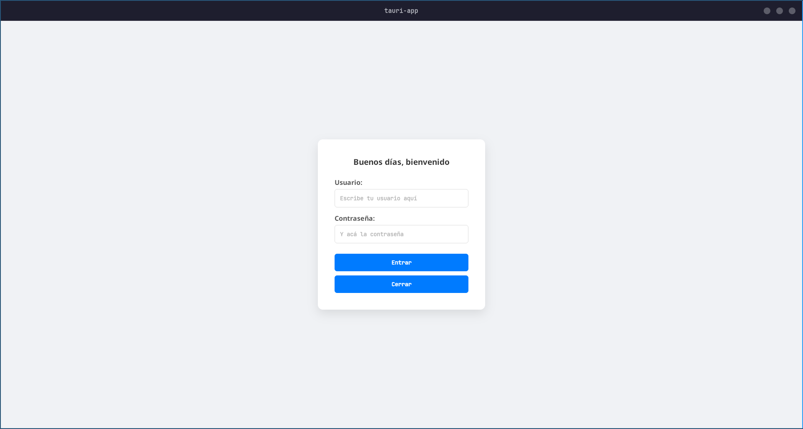
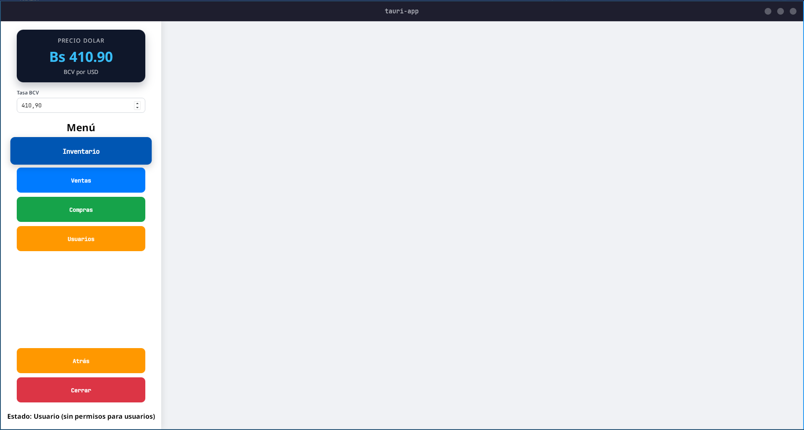
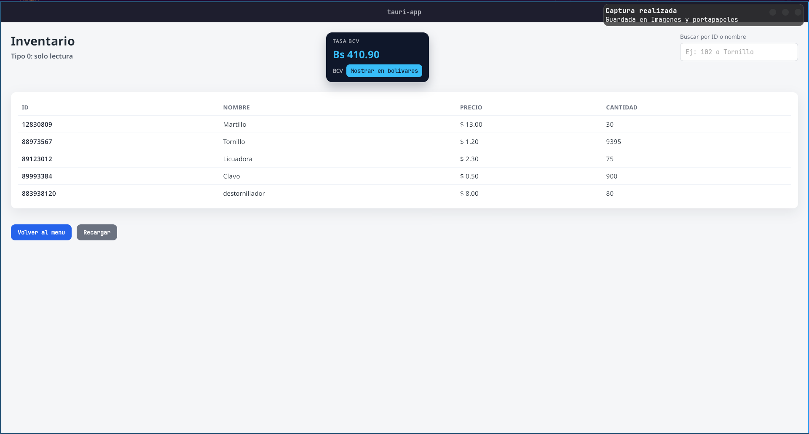
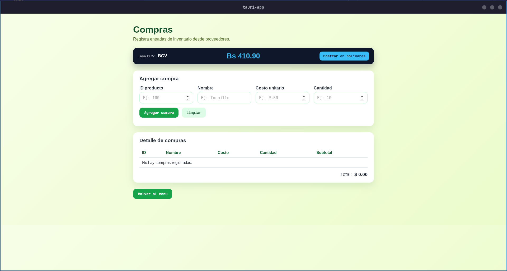
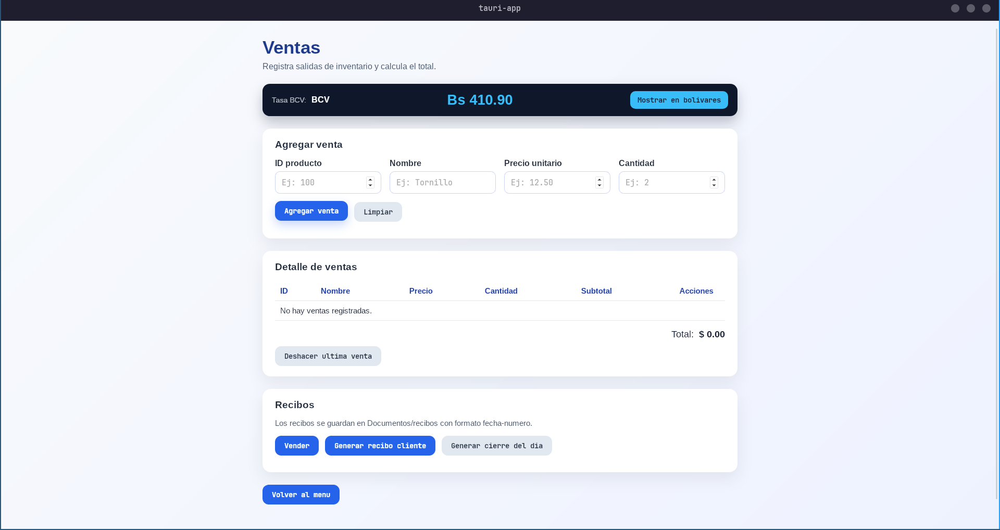
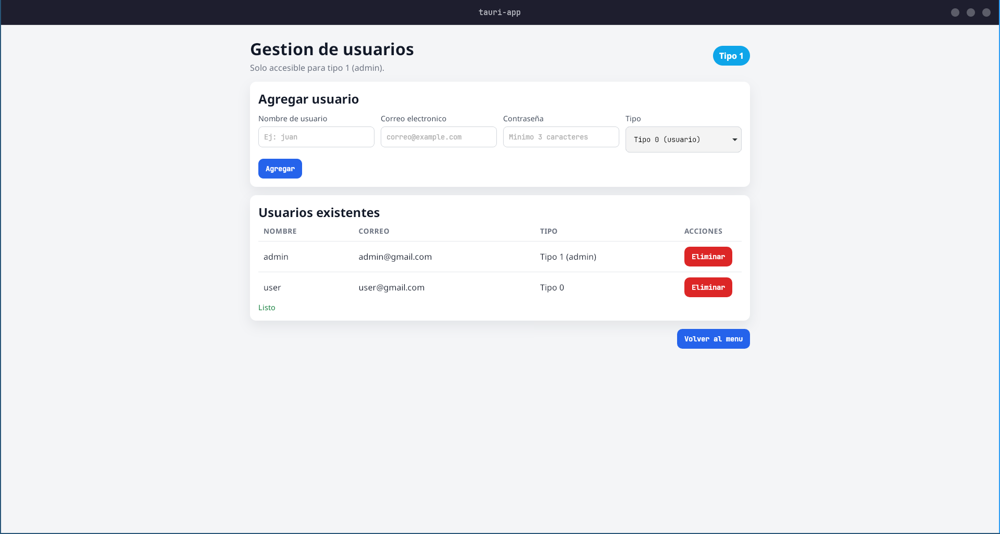

<pre style="font-size: 14px; line-height: 0.9; font-family: 'monospace'; background-color: transparent; border: none;">
#       _____ _____ __  __ _____  _      ______   _____ _   ___      ________ _   _ _______ ____  _______     __
#      / ____|_   _|  \/  |  __ \| |    |  ____| |_   _| \ | \ \    / /  ____| \ | |__   __/ __ \|  __ \ \   / /
#     | (___   | | | \  / | |__) | |    | |__      | | |  \| |\ \  / /| |__  |  \| |  | | | |  | | |__) \ \_/ / 
#      \___ \  | | | |\/| |  ___/| |    |  __|     | | | . ` | \ \/ / |  __| | . ` |  | | | |  | |  _  / \   /  
#      ____) |_| |_| |  | | |    | |____| |____   _| |_| |\  |  \  /  | |____| |\  |  | | | |__| | | \ \  | |   
#     |_____/|_____|_|  |_|_|    |______|______| |_____|_| \_|   \/   |______|_| \_|  |_|  \____/|_|  \_\ |_|   
</pre>                                                                                                           

## 📸 Screenshots | Capturas

| English | Español |
| --- | --- |
| **Login**  | **Inicio de sesión**  |
| **Main menu**  | **Menú principal**  |
| **Inventory**  | **Inventario**  |
| **Purchases**  | **Compras**  |
| **Sales**  | **Ventas**  |
| **User management**  | **Gestión de usuarios**  |

## 📦 Acerca del Proyecto

Este es un sistema de inventario simple, rápido y seguro. La interfaz de usuario está construida con **HTML** puro para mantenerla ligera, mientras que toda la lógica de negocio, el acceso a datos y el procesamiento se ejecutan en el backend usando **Rust**. Todo esto está empaquetado en una aplicación de escritorio nativa gracias a **Tauri**.

## ✨ Características Principales

* **Rendimiento Nativo:** El motor en Rust garantiza una ejecución ultrarrápida y un consumo mínimo de memoria RAM.
* **Almacenamiento Local (Offline-first):** Los datos se guardan de forma segura en tu máquina mediante una base de datos **SQLite** integrada. No requiere conexión a internet.
* **Interfaz Minimalista:** Un diseño en HTML limpio y sin complicaciones para gestionar tu inventario sin distracciones.
* **Multiplataforma:** Listo para ser compilado y ejecutado en Windows, macOS y Linux.

## 🚀 Requisitos Previos

Antes de clonar y ejecutar el proyecto, asegúrate de tener instalado tu entorno de desarrollo:

* [Rust (y Cargo)](https://www.rust-lang.org/tools/install)
* [Dependencias del sistema para Tauri](https://tauri.app/v1/guides/getting-started/prerequisites) (Varía según tu sistema operativo: C++ Build Tools en Windows, `webkit2gtk` en Linux, etc.)

## Este proyecto corre gracias a las tecnologias:

  <pre style="background-color: transparent; border: none; font-size: 16px; font-family: monospace;">
      (🦀) RUST                  (∞) TAURI                  (≡) SQLITE   

       _~^~^~_                    .-.   .-.                    ________    
   \) /  o o  \ (/               /   \ /   \                  /=======/|   
     '_   v   _'                 \    X    /                 | SQLite | |  
     / '-----' \                  '-'   '-'                  |   v3   |/   
                                                              --------    
  </pre>

